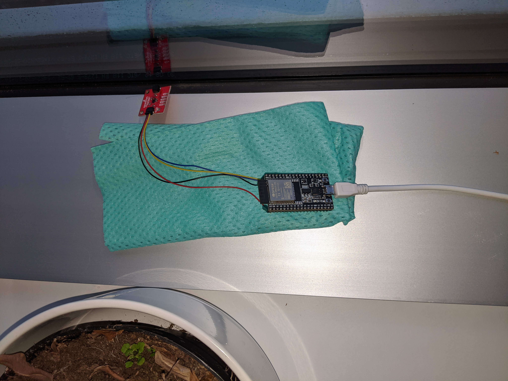

# Ambient lighting
Inverse the natural ambient lighting in a room. This project consists of a light sensor (VCNL4040 connected to an ESP32) and any number of ESP32s connected to 30 LED NeoPixel strips. The light sensor broadcasts ambient lighting data on UDP which is received by the LED strips.




## Step by step
### 1. Components
The project uses the following components:
#### Light Sensor
1. ESP32 dev board
2. VCNL4040 (https://www.sparkfun.com/products/15177)
3. Qwiic cable with female pins (https://www.sparkfun.com/products/17261)
4. USB to Micro USB
5. Power source (in my case a power bank)

#### Pixel Strips
1. ESP32 dev board
2. NeoPixel strip with 30 pixels (must be WS2812) (https://shop.m5stack.com/products/digital-rgb-led-weatherproof-strip-sk6812)
3. Female to male jumper cables
4. USB to Micro USB
5. Power source (in my case a power bank)

### 2. Putting everything together
#### Light sensor
See [this page](https://www.sparkfun.com/products/17261) for wire color coding on the Qwiic cable.
- GND > GND
- 3V3 > 3V3
- GPIO16 > SDA
- GPIO17 > SCL

#### Pixel strips
- GND > GND
- 3V3 > 3V3
- GPIO16 > data in

### 3. Running the program
Prepare the open source Toit language by following the steps [here](https://github.com/toitlang/toit).

#### Light sensor
Compile an ESP32 image from the light sensor program and flash it with:
```
cd <path-to-toit-lang>
make flash ESP32_ENTRY=<path-to-repository>/src/als_sensor.toit ESP32_WIFI_SSID=<wifi-ssid> ESP32_WIFI_PASSWORD=<wifi-password> ESP32_PORT=<device-port>
```
Connect the ESP32 that controls the light sensor to your computer and flash the program by pasting the output from `make esp32` into the terminal.

#### Pixel strips
Compile an ESP32 image from the pixel strip program and flash it with:
```
cd <path-to-toit-lang>
make flash ESP32_ENTRY=<path-to-repository>/src/pixel_strip.toit ESP32_WIFI_SSID=<wifi-ssid> ESP32_WIFI_PASSWORD=<wifi-password> ESP32_PORT=<device-port>
```
Connect the ESP32 that controls the light sensor to your computer and flash the program by pasting the output from `make esp32` into the terminal.


### 4. Put up the lights and the sensor
Once the programs have been flashed, they will start running every time the ESP32s are powered on.
